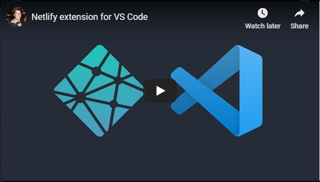

# Netlify for VS Code

**Unofficial Netlify extension for VS Code.**

 

## Features

* ✅ Deploy status and errors inside VS Code.
* 🌍 View latest production build with single click.
* 👀 Deploy preview straight from branch in VS Code.
* ⚡️ VS Code command palette integration.

## Documentation
- [Video Overview](#video-overview)
- [Status bar](#status-bar)
- [Command palette](#command-palette)
- [Settings](#settings)

### Video Overview

[](https://www.youtube.com/watch?v=N91S5UsT0Ng)


### Status bar

The deployment monitor in the VS Code status bar should show one of the following states:

* *Site is being deployed*
* *Site deploy was successful*
* *Site is waiting to be built*
* *Site deploy has failed*

### Command palette

You can run the following commands from the VS Code command palette:

* `Netlify: View latest deploy`
* `Netlify: View production site`

### Settings

You can configure the extension straight from VS Code settings, by simply searching for `Netlify`. However, should you wish, you can also configure it straight from the `settings.json` file as follows:


```json
{
  "netlify.site_id": "<site_name|api_id>",
  "netlify.api_token": "<personal_access_token>",
  "netlify.set_interval": "<number>"
}
```

These values are as follows:

#### *netlify.site_id*

The name of your site or api id can be used, you can find these details under **Site detail**. If you site name is `my-site` then you need to append `.netlify.com` so it will be `my-site.netlify.com`

#### *netlify.api_token*

The `api_token` is your *Personal Access Token* which can be found in *User Settings*, this will be used to authenticate private Netlify projects

#### *netlify.set_interval*

The default is 10000ms but you can set whatever polling interval you would like.
